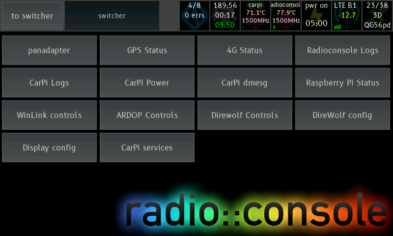

# radioconsole

Radioconsole is a GUI to control various Raspberry Pi, Linux and Radio related things. If you want a touchscreen controller to manage things running on various systems, this might be useful.

# Documentation

- [General Readme - this document](#a-quick-tour)
  - Overview of the Radioconsole apps
- [Installing Radioconsole](doc/radioconsole-install.md)
  - More specific instructions to install Radioconsole on a Pi
- [Theming Radioconsole](doc/theming-radioconsole.md)
  - How to customise Radioconsole's appearance
- [Direwolf Bluetooth](carpi-notes/direwolf-bluetooth.md)
  - How to set up Direwolf to allow TNC connections via Bluetooth
- [GPSd Difficulties](carpi-notes/gpsd-difficulties.md)
  - How to stop GPSd holding every serial port open, whether a GPS or not
  - How to make GPSd work if your GPS is FTDI or PL2303
  - How to stop GPSd reconfiguring your GPS back to NMEA mode
  - How to make GPSd not spend ages detecting baud rate when you know what it is
  - How to make GPSd listen on all interfaces and accept connections over the network

## Supported Hardware

This app is primarily designed to run on a Raspberry Pi, with the official touchscreen addon.

It is written in Python, using PyGame. It is primarily designed to draw directly to the framebuffer with no X running for the best performance, however as PyGame uses SDL, it can also use any other supported video card.

There is specific support for directly obtaining touch events from the FT5406 touchscreen controller as used in the official Raspberry Pi Touchscreen Display, as the included driver does not function correctly in framebuffer mode.

It will also run on Mac OS X as that is where a lot of the development occurs.

Required packages are in `requirements.txt`.

## How it works

A number of modules are provided to the user, and the user provides a `config.yaml` featuring configuration for one or more instances of each. An example config can be found in `config.yaml.example`.

# A quick tour

## The Switcher



This is the least interesting screen, but it's also the most important. This allows you to launch all the apps defined in the config.

**config.yaml:**
``` yaml
system:
  switcher:           # [Optional] - entire block is optional
    buttons_x: 4      # [Optional] how many columns of buttons, default 4
    button_h: 64      # [Optional] height in pixels, default 64
    button_margin: 2  # [Optional] margin between buttons, default 2
```

## Raspberry Pi Status

This module connects to a Raspberry Pi over SSH and displays system statistics.


Items queried are:

 - Hostname and model
 - CPU frequency/voltage
 - CPU temperature
 - Free RAM
 - Throttling information / voltage status / supply undervolt
    - ALERT: This throttling condition is currently active
    - PREV: This condition has happened since boot
    - OK: This condition has not yet happened
- CPU load (per core)

In the status icon, the following are displayed:

- hostname
- CPU temperature
- CPU frequency
- CPU load bar (all cores average)

The following warnings show on the status icon:

- Orange warning symbol: A throttling condition is occurring on the Pi
- Red warning symbol: The Pi cannot be contacted

**config.yaml:**
``` yaml
modules:
  raspi_status:
    type: raspi_status
    display_name: Raspberry Pi Status # name on switcher
    config:
      refresh_seconds: 1     # [Optional] number of seconds between updates, default 1
      hosts:                 # list of hosts to show
      - host: 127.0.0.1      # hostname / IP to connect to
        username: pi         # [Optional] username - default 'pi'
        port: 22             # [Optional] SSH port - default '22'
      - host: 172.16.0.29    # you can have multiple hosts
```

More than one host is supported (and they're much happier than the Pi above):


## LTE Status


In this screenshot you can see signal strength increasing, then starting to decrease as we drive through the town of Ararat.

This module will query modem connection statistics from a router running ROOTer. This module will work best if you have a Sierra Wireless modem attached but it should still work with other brands - I haven't tested.

Items queried are:

- Network Mode
- Current LAC/LACN (tower ID)
- Band Name / Frequency (shows frequency range for each band number)
- Downlink Frequency (decoded from earfcn)
- LTE segment bandwidth
- RSRQ (Reference Signal Received Quality)
- RSRP (Reference Signal Received Power)
- RSSI (Received Signal Strength Indicator), decoded from CSQ
- Modem temperature

**config.yaml**
``` yaml
modules:
  modem:
    type: lte_status
    display_name: '4G Status'
    config:
      backend: rooter       # only one supported for now
      host: 172.17.0.254    # host of modem to connect to
      port: 80              # [Optional] HTTP port to connect on, default 80
      username: root        # username for web interface 
      password: hunter2     # password for web interface
```

There is also a button in the top right to reboot the entire ROOTer box - this uses the web interface "reboot system" page to achieve this. Useful in case of prolonged misbehaviour.

There is also a log that shows when the LTE channel/band changes, when the mode changes, and when the LAC changes.

In the status icon, the following is displayed:

- Mode (LTE / UMTS / HSDPA)
- Band (e.g. B28)
- RSRQ (signal quality)
- and a signal bar showing the RSRQ

The following warnings show on the status icon:

- Orange warning symbol: The modem is not connected to the mobile network.
- Red warning symbol: The modem cannot be reached on the network.

## Log Viewer


This module displays the output of a long-running command on the configured host - like `tail -f` or `journalctl -f`. There are a set of configurable buttons along the bottom of the screen which will run pre-set commands on the remote host when pressed.

If the connection drops or the command terminates, the execution will be retried.

Depicted in the screenshot is the viewing of radioconsole's journalctl log. The button for `git status` has been pushed and the output has been appended to the current log view.

Like any other Radioconsole module, multiple instances can be configured to view different logs on different hosts.

Suggested usage includes:
- Viewing the journalctl log for a service and providing buttons to start and stop the service
- Viewing system logs on a remote host and having buttons to restart or shut it down

``` yaml
modules:
  logviewer:
    type: log_viewer
    display_name: log_viewer
    config:
      host: 127.0.0.1   # Host to SSH to
      username: pi      # [Optional] Username, defaults to 'pi'
      port: 22          # [Optional] SSH Port, defaults to 22
      command: journalctl -f --no-tail -u radioconsole.service 
      # [Optional] - no command required if you just want to be able to use the buttons
      # no-tail prints all previous messages
      filter_lines:            # [Optional] List of regexes. If a line matches the regex (partial match)
        - test                 #            the log line will not be printed. 
                               #            Use instead of piping to grep -v
      retry_seconds: 5         # [Optional] if command exits, re-run in, default 5
      max_scrollback: 50000    # [Optional] number of bytes of scrollback, default 50000
      command_buttons_x: 5     # [Optional] number of bottom command buttons per row
                               #            defaults to number of commands
      command_button_h: 48     # [Optional] height of a row of command buttons, default 48
      command_button_margin: 2 # [Optional] gap between command buttons, default 2
      commands: # [Optional] these commands are run on the host when you push one of the buttons
        restart: sudo service radioconsole restart
        update: cd radioconsole; git pull
        status: cd radioconsole; git status
        ifconfig: /sbin/ifconfig
        reboot: sudo reboot
```

## SystemD Log Viewer

Like the above log viewer but much more customised for SystemD logs.

This log viewer constructs the `journalctl` command to view the log in JSON format, and then parses the JSON from the remote end to have better control over how the log entries are formatted. Timestamps are printed with a date if they are not from today, and without the date if they are (to save space). 

Optionally, showing the service name can be disabled.

The command buttons function identically.

`filter_lines` regexes are checked against the parsed message output, not the JSON.

```yaml
modules:
  winlink:
    type: systemd_log_viewer
    display_name: WinLink controls
    config:
      host: 172.17.0.3         # Host to SSH to
      username: pi             # [Optional] Username, defaults to 'pi'
      port: 22                 # [Optional] SSH Port, defaults to 22
      services:                # List of services, without the '.service' to tail logs for
        - pat
        - ardopc
        - rigctld
      show_service_name: False # [Optional] Show the service name in the log.
                               #            Default: False if only one service being monitored
                               #                     True if more than one service
      filter_lines:            # [Optional] List of regexes. If a line matches the regex (partial match)
        - test                 #            the log line will not be printed. 
                               #            Use instead of piping to grep -v
      retry_seconds: 5         # [Optional] if command exits, re-run in, default 5
      max_scrollback: 50000    # [Optional] number of bytes of scrollback, default 50000
      command_buttons_x: 5     # [Optional] number of bottom command buttons per row
                               #            defaults to number of commands
      command_button_h: 48     # [Optional] height of a row of command buttons, default 48
      command_button_margin: 2 # [Optional] gap between command buttons, default 2
      commands:
        start_winlink: sudo service waterfall_server stop; sudo /root/USBPacket.sh; sudo service ardopc start; sudo service rigctld start
        stop_winlink: sudo service ardopc stop; sudo service rigctld stop; sudo /root/USBVoice.sh; sudo service waterfall_server start
```

## SystemD Status

Connects to a remote host and queries the state of running services.

For provided services, will show:

- Load state of service (loaded, unloaded)
- Run state of service (running, dead)
- Activity state of service (active, inactive, disabled, activating, failed)

There are also buttons to query the status of the service (appearing in a terminal window at the bottom), and to start/stop the service.

A status icon shows the number of services that are running out of the listed number of services, and a count of services in the errored state.

The following warnings show on the status icon:

- Orange warning symbol: One or more services are in a failed state.
- Red warning symbol: The remote host cannot be connected to.

```yaml
modules:
  services:
    type: systemd_status
    display_name: "CarPi services"
    config:
      host: 172.17.0.3    # Host to connect to
      username: pi        # [Optional] SSH username, default 'pi'
      port: 22            # [Optional] SSH port, default 22
      retry_seconds: 30   # [Optional] number of seconds between refreshes, default 30
      services:           # One or more services to monitor
        - freeselcall
        - direwolf
        - gpio_shutdown
        - waterfall_server
        - ardopc
        - auto_rx
        - chasemapper
        - pat
```

## GPS Status

Connects to a GPSd server. For some info on how to get GPSd to behave properly, [see here](carpi-notes/gpsd-difficulties.md)

Shows the following:

- Satellites being seen/used by constellation
- Satellite positions / Current heading on compass-like view
- Current lat/lon
- Current altitude
- Fix type
- Number of sats used
- Current speed
- Current track (relative to True North)
- 8 character [Maidenhead grid reference](https://en.wikipedia.org/wiki/Maidenhead_Locator_System)

Shown on the status icon:

- Satellites used
- Fix type
- 6 character Maidenhead grid

The following warnings show on the status icon:

- Orange warning symbol: GPS has no fix.
- Red warning symbol: GPSd server cannot be connected to.

```yaml
modules:
  gpsd:
    type: gpsd
    display_name: GPS Status
    config:
      host: 172.17.0.3  # GPSd host
      port: 2947        # [Optional] GPSd port, default 2947
```

## Waterfall Display


Waterfall in Relative Mode, 75k bandwidth, decimation zoom


Waterfall in Relative Mode, 37.5k bandwidth, viewing a SSB signal


Waterfall in Absolute Mode, showing all of 40m, showing a few signals visible (my local noise floor is quite high). An Ionosonde can be seen sweeping up through the band.

This module connects to a waterfall server which sends a FFT spectrum from a rtl-sdr dongle. Suggested usage is to connect the rtl-sdr to the first IF of the radio.

Support exists to display the waterfall centred on the currently tuned frequency or offset it to show just the entire band on the screen. No support exists for reading this frequency off the radio.

This module is still very much a work in progress.

This is being used with an Icom 7100 that has a SDR-Kits PAT150M installed in it.

``` yaml
panadapter:
  type: rtl_fft
  display_name: panadapter
  config:
    HOST: 172.16.0.50   # host for the waterfall_server
    PORT: 45362
    INVERTED: true      # swap I/Q?
    graph_height: 64    # [Optional] Signal graph height above waterfall, default 64
    button_height: 48   # [Optional] Button height in bottom of UI, default 48
    RF_MIN: 0
    RF_MAX: 500
    SAMPLE_PROVIDER: rtlsdr
  ```

The waterfall server is found at `apps/WaterfallDisplay/WaterfallServer.py`. It is configured as a top level entry in the same `config.yaml` file - it can be shared between radioconsole and the waterfall server if running on the same box.

``` yaml
waterfall_server:
  listen_port: 45362
  device_serial: '00000007'
  if_freq: 124488500 # 124487000 + 1500
  sample_rate: 1200000
```
