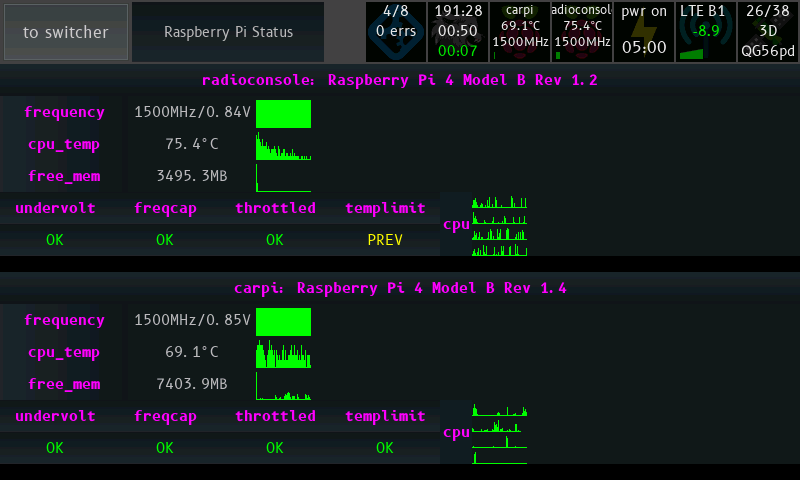
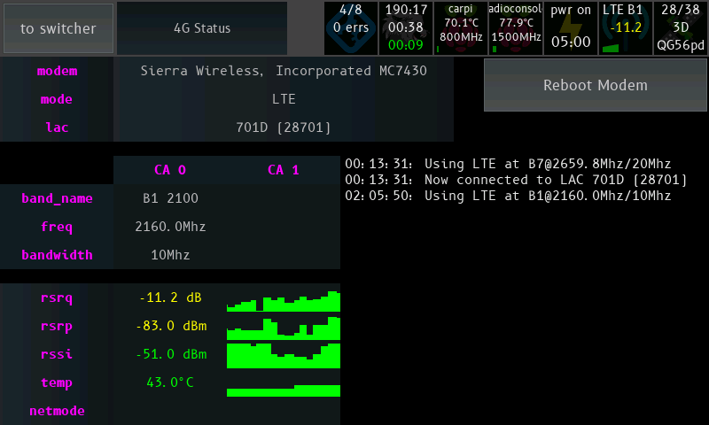
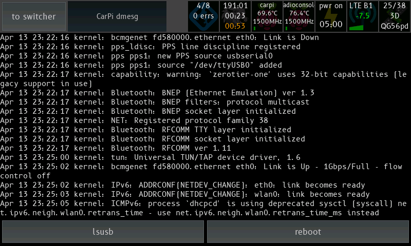
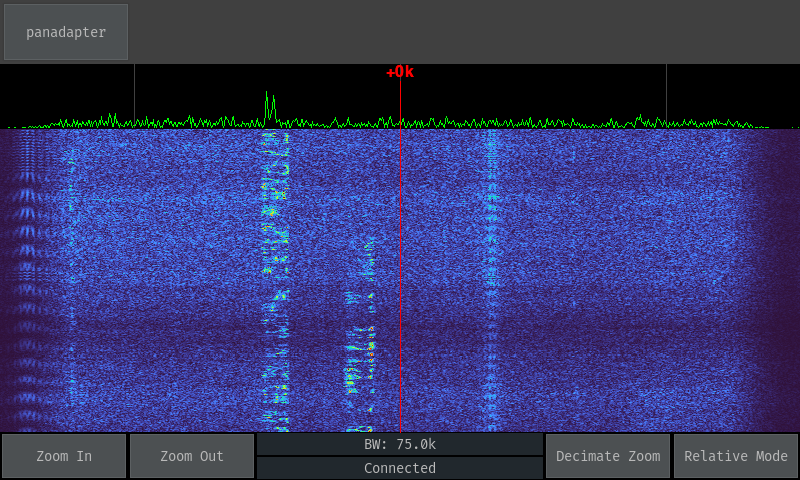

# radioconsole

Radioconsole is a GUI to control various Raspberry Pi, Linux and Radio related things. If you want a touchscreen controller to manage things running on various systems, this might be useful.

## Supported Hardware

This app is primarily designed to run on a Raspberry Pi, drawing directly to the screen with no X running but as it's written in Python and PyGame, it should run on many other platforms as well.  There is specific support for directly obtaining touch events from the FT5406 touch chip as used in the official Raspberry Pi Touchscreen Display to work around touch being broken in framebuffer mode.

It's known to also work on Mac OS X as that is where some development occurs.

## How it works

A number of modules are provided to the user, and the user provides a `config.yaml` featuring configuration for one or more instances of each.

# A quick tour

## The Switcher


This is the least interesting screen, but it's the most important. This allows you to launch all the apps defined in the config.

**config.yaml:**
``` yaml
system:
  switcher:
    BUTTONS_X: 4      # how many columns of buttons
    BUTTON_H: 64      # height in pixels
    BUTTON_MARGIN: 2  # margin between buttons
```

## Raspberry Pi Status

This module connects to a Raspberry Pi over SSH and displays system statistics.



Items queried are:
 - Hostname and model
 - CPU frequency/voltage
 - CPU temperature
 - Free RAM
 - Throttling information / voltage status
    - ALERT: This throttling condition is currently active
    - PREV: This condition has happened since boot
    - OK: This condition has not yet happened
- CPU load (per core)

**config.yaml:**
``` yaml
modules:
  raspi_status:
    type: raspi_status
    display_name: Raspberry Pi Status # name on switcher
    config:
      refresh_seconds: 1     # number of seconds between updates
      line_height: 32        # line height
      hosts:
      - host: 127.0.0.1      # hostname to connect to - can be local too
        username: pi       # note: only SSH key based auth supported
        port: 22
      - host: 172.16.0.29    # you can have multiple hosts!
        username: pi
        port: 22
```

More than one host is supported:


## LTE Status



This module will query modem connection statistics from a router running ROOTer. This module will work best if you have a Sierra Wireless modem attached but it should still work with other brands - I haven't tested.

Items queried are:
- Network Mode
- Current LAC/LACN (tower ID)
- Band Name / Frequency (shows frequency range for each band number)
- Downlink Frequency (decoded from earfcn)
- LTE segment bandwidth
- RSRQ (Reference Signal Received Quality)
- RSRP (Reference Signal Received Power)
- RSSI (Received Signal Strength Indicator), decoded from CSQ
- Modem temperature

**config.yaml**
``` yaml
modules:
  modem:
    type: lte_status
    display_name: '4G Status'
    config:
      backend: rooter       # only one supported for now
      line_height: 32
      host: 172.17.0.254
      username: root
      password: hunter2
```

## Log Viewer



This module displays the output of a long-running command on the configured host - like `tail -f` or `journalctl -f`. There are a set of configurable buttons along the bottom of the screen which will run pre-set commands on the remote host when pressed.

If the connection drops or the command terminates, the execution will be retried.

Depicted in the screenshot is the viewing of radioconsole's journalctl log. The button for `git status` has been pushed and the output has been appended to the current log view.

Like any other Radioconsole module, multiple instances can be configured to view different logs on different hosts.

Suggested usage includes:
- Viewing the journalctl log for a service and providing buttons to start and stop the service
- Viewing system logs on a remote host and having buttons to restart or shut it down

``` yaml
modules:
  logviewer:
    type: log_viewer
    display_name: log_viewer
    config:
      host: 127.0.0.1 # SSH details
      username: pi
      port: 22
      command: journalctl -f --no-tail -u radioconsole.service
      # no-tail prints all previous messages
      retry_seconds: 5         # if command exits, re-run in
      max_scrollback: 50000    # number of bytes
      command_buttons_x: 5     # number of bottom command buttons per row
      command_button_h: 48     # height of a row of command buttons
      command_button_margin: 2 # gap between command buttons
      commands: # these commands are run on the host when you push the button
        restart: sudo service radioconsole restart
        update: cd radioconsole; git pull
        status: cd radioconsole; git status
        ifconfig: /sbin/ifconfig
        reboot: sudo reboot
```

## Waterfall Display


Waterfall in Relative Mode, 75k bandwidth, decimation zoom


Waterfall in Relative Mode, 37.5k bandwidth, viewing a SSB signal


Waterfall in Absolute Mode, showing all of 40m, showing a few signals visible (my local noise floor is quite high). An Ionosonde can be seen sweeping up through the band.

This module connects to a waterfall server which sends a FFT spectrum from a rtl-sdr dongle. Suggested usage is to connect the rtl-sdr to the first IF of the radio.

Support exists to display the waterfall centred on the currently tuned frequency or offset it to show just the entire band on the screen. No support exists for reading this frequency off the radio.

This module is still very much a work in progress.

This is being used with an Icom 7100 that has a SDR-Kits PAT150M installed in it.

``` yaml
panadapter:
  type: rtl_fft
  display_name: panadapter
  config:
    HOST: 172.16.0.50 # host for the waterfall_server
    PORT: 45362
    INVERTED: true # swap I/Q
    GRAPH_HEIGHT: 64
    BUTTON_HEIGHT: 48
    RF_MIN: 0
    RF_MAX: 500
    SAMPLE_PROVIDER: rtlsdr
  ```

The waterfall server is found at `apps/WaterfallDisplay/WaterfallServer.py`. It is configured as a top level entry in the same `config.yaml` file - it can be shared between radioconsole and the waterfall server if running on the same box.

``` yaml
waterfall_server:
  listen_port: 45362
  device_serial: '00000007'
  if_freq: 124488500 # 124487000 + 1500
  sample_rate: 1200000
```

# Mostly Raspberry Pi focused Installation Notes

Install [Raspberry Pi OS](https://www.raspberrypi.org/downloads/raspberry-pi-os/) onto your card and boot up.

Is your touchscreen upside down? Add `lcd_rotate=2` to `/boot/config.txt` and reboot. There's some dispute between different case manufacturers about which way is up, and the Raspberry Pi foundation changed their mind as well.

Don't use `display_rotate` if you're using the official touchscreen - that will rotate in software which is slower.

Run `sudo raspi_config` and set the following:
- Menu 1 -> Change your password
- Menu 2 -> Set up your WLAN network
- Menu 3 -> Set boot settings to console-only with no auto-login
- Menu 3 -> Disable wait for network on boot
- Menu 5 -> Enable SSH

Generate a SSH key, making sure it is in PEM format. The current stable version of paramiko does not support the new openssh format keys.
```
ssh-keygen -m pem
````

Copy the key generated under the pi user to root.
```
sudo cp -R ~/.ssh ~root/
```

Allow the root user to connect back in as pi over SSH (used for raspi_status)
```
cat ~/.ssh/id_rsa.pub >> ~/.ssh/authorized_keys
```

Install some of the required libraries through apt-get to allow downloading binaries rather than building from source, saving a bit of time.
```
sudo apt-get install python3-pip python3-numpy python3-pygame cython3 libfftw3-dev librtlsdr-dev python3-scipy python3-paramiko
```

Install Radioconsole
```
sudo apt-get install git
git clone git@github.com:gm-stack/radioconsole.git
cd radioconsole
```

Install the rest of the dependencies
```
sudo pip3 install -r requirements.txt
```

Install the driver for FT5406 touchscreen controllers.
```
git clone https://github.com/pimoroni/python-multitouch
cd python-multitouch
sudo ./install
```

Edit config.yml (ok, you don't have to use `vim`) - see above sections for a config reference.
```
sudo apt-get install vim
vim config.yaml
```

Install the SystemD service for radioconsole to make it start on boot:
```
sudo cp radioconsole.service /etc/systemd/system/
sudo systemctl enable radioconsole
sudo systemctl start radioconsole
```

If using the rtlsdr panadapter (if you don't know what that is, you probably won't) - also, this can go on another Pi if the rtlsdr isn't plugged into this one:
```
cp waterfall_server.service /etc/systemd/system/
systemctl enable waterfall_server
systemctl start waterfall_server
```

Optional:
Add `disable_splash=1`, `dtoverlay=pi3-disable-bt` (if on pi3), `boot_delay=0` to /boot/cmdline.txt to save about 5-7 seconds on boot.

# Theming

`pygame_gui` supports a theme file, normally in JSON. Radioconsole will take whatever is defined in `config.yaml` under `theme`, convert it to JSON, and load it into `pygame_gui`.

``` yaml
theme:
  defaults:
    colours:
      normal_bg: "#4c5052"
      hovered_bg: "#63686b"
      disabled_bg: "#25292e"
      selected_bg: "#365880"
      active_bg: "#365880"
      dark_bg: "#21282d"
      disabled_dark_bg: "#181818"
      normal_text: "#bbbbbb"
      hovered_text: "#bbbbbb"
      disabled_text: "#808080"
      selected_text: "#bbbbbb"
      active_text: "#bbbbbb"
      normal_border: "#5c6062"
      hovered_border: "#73787b"
      disabled_border: "#35393e"
      selected_border: "#466890"
      active_border: "#466890"
      link_text: "#6897bb"
      link_hover: "#84bfed"
      link_selected: "#84bfed"
      text_shadow: "#777777"
      filled_bar: "#f4251b"
      unfilled_bar: "#CCCCCC"
  '#param_label':
    colours:
      normal_text: "#FF00FF"
      dark_bg: "#151D22"
    font:
      name: "fira_code"
      size: 14
      bold: 1
```